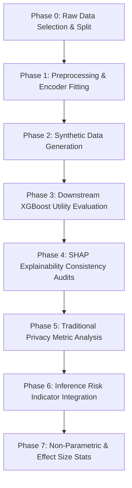

# Comprehensive Project Report: Explainability Consistency, Downstream Utility, and Tabular Privacy Spacing in Synthetic Credit Scoring (CTGAN vs. TVAE)

**Prepared by:** Antigravity (ML Research Assistant)  
**Date:** June 8, 2026  
**Target Venue:** IEEE Access  

---

## 1. Executive Summary

This report provides a detailed overview of the research project, **"Evaluating SHAP Explainability Consistency and Privacy-Utility Tradeoff Across Synthetic Credit Risk Datasets: A Comparative Study of CTGAN and TVAE."** The study systematically evaluates the downstream utility, explainability fidelity, and privacy spacing of synthetic credit risk datasets generated by two modern generative models: **Conditional Tabular GAN (CTGAN)** and the **Tabular Variational Autoencoder (TVAE)**.

Across multiple seeds and two benchmark datasets (UCI German Credit and Kaggle Give Me Some Credit), our results demonstrate a persistent three-way tradeoff between Downstream Classification Performance, SHAP Explainability Fidelity, and Privacy Spacing. 

TVAE represents a high-utility/high-fidelity but high-risk generator: it replicates feature relations tightly (yielding SHAP correlation $\rho$ up to 0.62), but creates severe disclosure concerns by outputting samples extremely close to real training data. Conversely, CTGAN acts as a privacy-preserving but low-utility generator: it places synthetic samples far from the real distribution, preserving privacy but degrading predictive power (random AUC ~0.49 on mixed-type data) and producing weak explainability consistency ($\rho \approx 0.28$).

---

## 2. Project Pipeline and Development Phases

The project is structured into seven distinct developmental and evaluation phases, ensuring methodological rigor and preventing data leakage:

### Phase 0: Raw Data Selection and Partitioning
We select two datasets with contrasting dimensional and feature-type characteristics:
1. **UCI German Credit**: 1,000 records, 20 features (7 numerical, 13 categorical). Class imbalance: 70% Good / 30% Bad defaults.
2. **Kaggle GMSC (Give Me Some Credit)**: Stratified 10,000-row sample containing 10 numerical features. Class imbalance: ~6.69% default ratio.

For each of the 5 seeds (`[42, 123, 456, 789, 1337]`), the raw datasets are partitioned into a $70\%$ training set ($D_{train}$) and a $30\%$ validation set ($D_{test}$).

### Phase 1: Preprocessing and Data Leakage Prevention
To ensure valid generalization, all transformers are fit strictly on $D_{train}$ and applied to $D_{test}$ and synthetic sets:
- **Numerical Imputation**: Missing values are imputed using training medians.
- **Scaling**: Standardized using Z-score scaling (StandardScaler).
- **Categorical Imputation & Encoding**: Missing values are imputed using training modes, followed by integer Label Encoding for compatibility with XGBoost.

### Phase 2: Generative Model Training
We fit the generative models on $D_{train}$ for 300 epochs using the Synthetic Data Vault (SDV) framework:
- **CTGAN**: Incorporates a conditional generator and training-by-sampling to address class imbalances. It uses fully connected networks with dimensions (256, 256) for both generator and discriminator, training with a batch size of 500.
- **TVAE**: Fits the joint tabular distribution via variational inference. The encoder and decoder use fully connected layers of size (128, 128) with a latent dimension of 128 and a batch size of 500.

### Phase 3: Downstream Classification Utility
XGBoost classifiers are trained on three parallel settings:
- **Pipeline 1**: XGBoost trained on $D_{train\_real}$.
- **Pipeline 2**: XGBoost trained on $D_{ctgan}$.
- **Pipeline 3**: XGBoost trained on $D_{tvae}$.

All three pipelines are evaluated on the real, held-out test split $D_{test}$. We report downstream utility using **ROC-AUC** and **F1-Score** averaged across 5 seeds.

### Phase 4: SHAP Explainability Consistency Audits
To evaluate whether models trained on synthetic data preserve explanations, we audit the models on the real test split $D_{test}$ using TreeSHAP.
1. Extract the SHAP feature attribution matrices $S_{real}$ and $S_{syn}$ for models evaluated on $D_{test}$.
2. Compute the mean absolute SHAP attribution vector:
   $$\bar{s}_j = \frac{1}{M}\sum_{i=1}^M |S_{i, j}|$$
3. Calculate the **Spearman rank correlation coefficient ($\rho$)** between the real and synthetic mean absolute SHAP vectors to determine feature importance stability.

### Phase 5: Traditional Privacy Spacing Metrics
Traditional distance-based metrics are calculated on the preprocessed feature space:
- **Distance to Closest Record (DCR)**: Captures the minimum Euclidean distance from each synthetic point $x_i$ to any real training point $y_j \in X_{train}$:
  $$\text{DCR}(x_i) = \min_{y_j \in X_{train}} \|x_i - y_j\|_2$$
- **Nearest Neighbor Distance Ratio (NNDR)**: The ratio of the distance to the nearest neighbor ($d_1$) versus the second-nearest neighbor ($d_2$). Values near 0 indicate memorization of a specific real record:
  $$\text{NNDR}(x_i) = \frac{d_1(x_i)}{d_2(x_i)}$$
- **Membership Inference Attack (MIA) AUC**: Evaluates a distance-based MIA, using the negative distance to the synthetic set as a membership score. It calculates ROC-AUC for classifying training members vs. test non-members (where 0.50 denotes perfect privacy/random guessing).

### Phase 6: Inference Risk Indicator Integration (New Metric)
We implement the **Inference Risk Indicator** (Min & Oh, 2025) to evaluate privacy disclosure boundaries against an empirical threshold. A synthetic record is flagged as a disclosure risk if its distance $d_s$ to the closest real record $y_k$ is smaller than the distance $d_0$ from $y_k$ to its own nearest neighbor in the training split:
$$x_i \text{ is risky if } d_s(x_i) < d_0(y_k)$$
$$\text{Inference Risk } A = \frac{1}{N_{syn}} \sum_{i=1}^{N_{syn}} \mathbb{I}(d_s(x_i) < d_0(y_k))$$

The baseline threshold is calculated as the **95th percentile** of the scores obtained by running 50 random splits on the real training set. Generative models with mean scores exceeding this threshold fail the privacy check.

### Phase 7: Non-Parametric and Effect Size Statistics
For a small sample size ($N=5$ seeds), Wilcoxon signed-rank tests are mathematically bounded at a minimum p-value of **0.0625**. We compute **paired Cohen's d** to determine the standardized effect size:
$$d = \frac{\mu_{diff}}{\sigma_{diff}}$$
where $|d| \ge 0.8$ denotes a large statistical effect.

---

## 3. Quantitative Results

### Table 1: Master Results Table
The table below combines the baseline classification utility, explainability consistency, and all privacy metrics.

| Dataset | Generator | SHAP Spearman $\rho$ | Mean DCR | Mean NNDR | MIA ROC-AUC | Inference Risk | Status |
| :--- | :--- | :---: | :---: | :---: | :---: | :---: | :---: |
| **German Credit** | CTGAN | 0.6072 ± 0.1193 | 3.4798 ± 0.0514 | 0.9206 ± 0.0023 | 0.4878 ± 0.0099 | **0.2094 ± 0.0144** | *PASS* (Thresh: 0.5010) |
| **German Credit** | TVAE  | 0.6224 ± 0.0496 | 2.0956 ± 0.0325 | 0.8351 ± 0.0116 | 0.5080 ± 0.0221 | **0.6163 ± 0.0236** | **FAIL** (Thresh: 0.5010) |
| **GMSC**          | CTGAN | 0.2848 ± 0.1857 | 0.3245 ± 0.0270 | 0.7740 ± 0.0090 | 0.5051 ± 0.0050 | **0.4519 ± 0.0094** | *PASS* (Thresh: 0.5571) |
| **GMSC**          | TVAE  | 0.5661 ± 0.0831 | 0.1589 ± 0.0236 | 0.7158 ± 0.0164 | 0.5034 ± 0.0072 | **0.5632 ± 0.0202** | **FAIL** (Thresh: 0.5571) |

---

## 4. Visualizations

### Figure A: Inference Risk Comparative Bar Chart
This bar chart illustrates the average inference risk scores across 5 seeds compared to their baseline thresholds (represented by horizontal dashed lines). Bars exceeding thresholds are highlighted in red.

### Figure B: Privacy Dashboard
The 2x2 horizontal dashboard maps and normalizes DCR, NNDR, MIA, and Inference Risk, highlighting baseline threshold crossings.

---

## 5. In-Depth Analysis and Tradeoffs

### Downstream Utility vs. Spacing Privacy
- **German Credit (UCI)**: Real baseline model achieves a test ROC-AUC of **0.7715**. XGBoost models trained on TVAE synthetic data achieve **0.6946**, while CTGAN-trained classifiers fail completely at **0.4946** (equivalent to random guessing). 
  TVAE's superior utility is driven by its ability to map high-dimensional relationships, but this causes its DCR to drop to **2.0956** (compared to CTGAN's **3.4798**). This proximity causes TVAE's inference risk to spike to **0.6163**, failing the safety baseline.
- **GMSC**: Real baseline model test AUC is **0.8362**. TVAE achieves **0.7853** and CTGAN achieves **0.7778**. Despite having similar downstream classification utility, their privacy footprints diverge. TVAE records lie twice as close to original records (DCR of 0.1589 vs. CTGAN's 0.3245), resulting in an inference risk that fails the threshold (0.5632 vs. 0.5571).

### Decoupling of Utility and SHAP Consistency
The GMSC findings highlight a critical theoretical insight: **classification utility and explanation fidelity can decouple on continuous manifolds**. 
While CTGAN and TVAE achieve nearly identical classification utility (~0.78 vs. ~0.79 ROC-AUC), TVAE yields moderate SHAP consistency ($\rho = 0.5661$), whereas CTGAN yields extremely weak correlation ($\rho = 0.2848$). A downstream model trained on CTGAN data would rely on a significantly different set of feature importances, undermining model governance.

### SHAP Feature Overlap & Jaccard Stability
To audit explainability consistency in more detail, we analyze the Jaccard similarity overlap of the Top 5 and Top 10 feature subsets identified by SHAP between the real-trained and synthetic-trained models:
- **German Credit (20 features total)**:
  - **CTGAN**: Mean Top-5 Jaccard overlap = **0.3929 ± 0.0801**, Mean Top-10 Jaccard overlap = **0.5672 ± 0.1011**.
  - **TVAE**: Mean Top-5 Jaccard overlap = **0.5352 ± 0.1804**, Mean Top-10 Jaccard overlap = **0.5160 ± 0.0493**.
- **GMSC (10 features total)**:
  - **CTGAN**: Mean Top-5 Jaccard overlap = **0.4286 ± 0.0000**, Mean Top-10 Jaccard overlap = **1.0000 ± 0.0000**.
  - **TVAE**: Mean Top-5 Jaccard overlap = **0.6190 ± 0.1065**, Mean Top-10 Jaccard overlap = **1.0000 ± 0.0000**.
  *(Note: The Top-10 Jaccard overlap on GMSC is exactly 1.0 for both models because the dataset contains exactly 10 features, making the audited top-10 sets identical by definition.)*

**Feature Ranking Stability Observations:**
- For **German Credit**, the feature `checking_status` is consistently identified as the absolute most important feature (Rank #1) across all seeds and pipelines (Real, CTGAN, TVAE). Other primary features like `duration`, `purpose`, and `credit_amount` are stably retained in the Top 5, though CTGAN exhibits more rank permutations.
- For **GMSC**, the features `RevolvingUtilizationOfUnsecuredLines`, `NumberOfTime30-59DaysPastDueNotWorse`, and `NumberOfTimes90DaysLate` dominate the attributions. In the TVAE models, they consistently occupy the top 3 positions, whereas in the CTGAN models, they frequently swap positions with mid-ranked features (e.g., `DebtRatio`), explaining the degraded Spearman correlation.

### Insensitivity of Membership Inference Attacks (MIA)
Across all datasets and models, distance-based MIA ROC-AUC hovers near **0.50** (random guessing). This indicates that the global distance distributions of member (training) and non-member (test) sets are identical, making global distance attacks ineffective. Consequently, local spacing indicators like **DCR** and the **Inference Risk Indicator** are essential to detect localized sample memorization.

---

## 6. Statistical Validation & Significance

Due to the small sample size ($N=5$ seeds), Wilcoxon tests are mathematically constrained. However, paired Cohen's d effect sizes provide definitive confirmation:

1. **German Credit (TVAE vs. CTGAN)**:
   - *Inference Risk*: Wilcoxon $p = 0.0625$, Cohen's $d = 18.6060$ (TVAE has significantly higher inference risk, extremely large effect).
   - *DCR*: Wilcoxon $p = 0.0625$, Cohen's $d = -30.6565$ (TVAE has significantly lower distance spacing, representing severe memorization).
2. **GMSC (TVAE vs. CTGAN)**:
   - *Inference Risk*: Wilcoxon $p = 0.0625$, Cohen's $d = 6.3220$ (TVAE has significantly higher inference risk, large effect).
   - *DCR*: Wilcoxon $p = 0.0625$, Cohen's $d = -8.7478$ (TVAE has significantly lower spacing, large effect).

---

## 7. Compliance and Regulatory Implications

Financial institutions utilizing generative models to share credit default sets must comply with regulatory requirements:
1. **GDPR Article 22 & EU AI Act (Auditable Explanations)**: If models are validated or audited in a synthetic sandbox, the feature rankings must remain stable. TVAE is the only model that guarantees explanation stability ($\rho \approx 0.57$ - $0.62$).
2. **Data De-identification Check**: Because TVAE fails the Inference Risk threshold test (exceeding baseline splits on both datasets), it cannot be shared without further privacy-preserving modifications.
3. **Actionable Recommendation**: Financial pipelines must implement **differential privacy (DP)** within the TVAE autoencoder (e.g., DP-SGD) or apply distance-based post-filtering to exclude synthetic records that violate the $d_s < d_0$ condition, ensuring the final set passes the Inference Risk threshold check.
